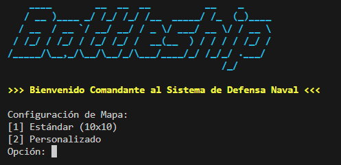

# Battleship ARM

[](https://github.com/Geovanni-Gonzalez/BattleshipARM/actions/workflows/ci.yml)

## Descripción
Implementación del juego Battleship en ensamblador ARM, organizada por tablero, barcos, entrada/salida, datos y utilidades.

## Objetivo
Practicar programación de bajo nivel, modularización en ensamblador y compilación con Makefile.

## Tecnologías utilizadas
- ARM Assembly
- Makefile
- GNU toolchain
- Consola

## Funcionalidades principales
- Lógica base de Battleship
- Módulos separados
- Compilación con Makefile
- Ejecutable incluido

## Mi rol
Implementé la lógica principal y módulos de apoyo en ensamblador.

## Aprendizajes clave
- Registros ARM
- Modularización ASM
- Makefile
- Flujo de juego bajo nivel

## Instalación y ejecución
El Makefile usa `arm-linux-gnueabihf-as`, `arm-linux-gnueabihf-ld` y `qemu-arm`.
```bash
cd BattleshipARM
make
make run
```
También puede ejecutarse el binario directamente en un entorno ARM compatible:
```bash
./battleship
```

## Estructura del proyecto
- src/main.s: flujo
- src/board.s y ships.s: tablero/barcos
- src/io.s, data.s, utils.s: soporte
- Makefile: compilación

## Capturas o demo


## Estado del proyecto
Proyecto académico funcional según entorno.

## Valor técnico demostrado
Evidencia comprensión de arquitectura ARM y manejo manual de flujo.

## Mejoras futuras
- Agregar guía de instalación del toolchain ARM
- Agregar casos de ejecución
- Incluir partida completa

## Autor
Geovanni González  
Estudiante de Ingeniería en Computación  
GitHub: [Geovanni-Gonzalez](https://github.com/Geovanni-Gonzalez)


